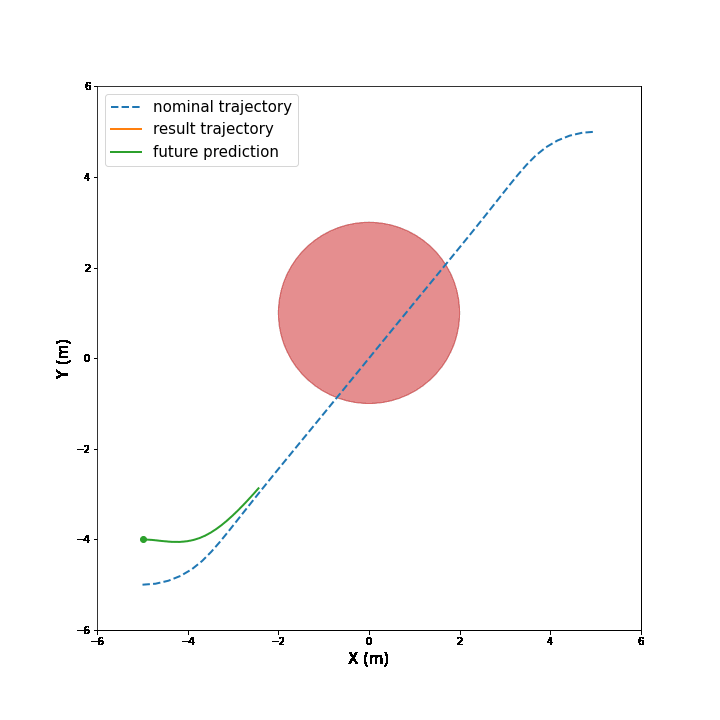
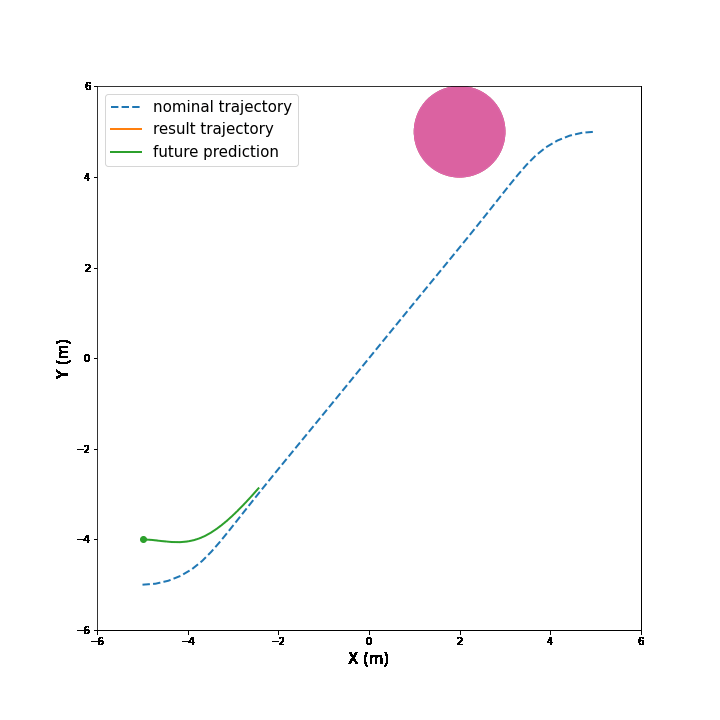
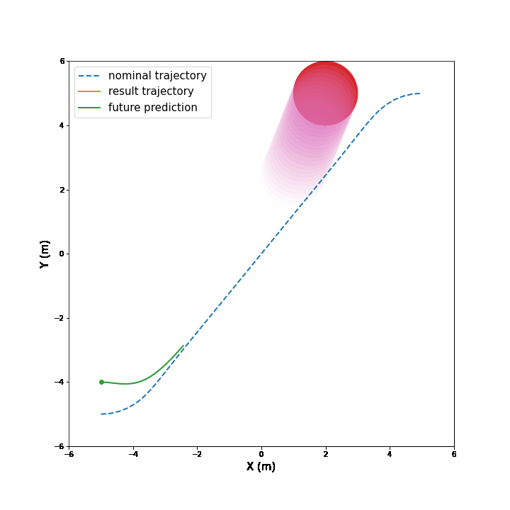
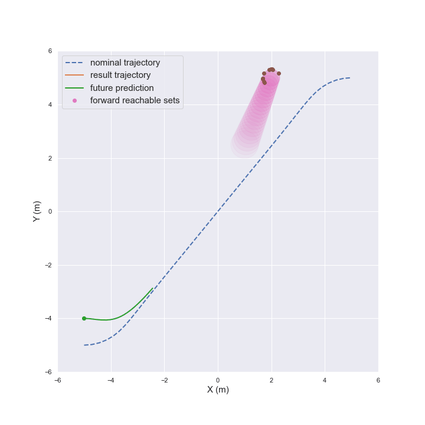

# Robust Model predictive control via sequential convex programming for obstacle avoidance
 - The current version is using Gurobi solver. If you don't have a license, change it to ECOS in PTR_in_MPC.py and PTR_tf_free.py

## Static obstacle avoidance for unicycle model

## Moving obstacle avoidance for unicycle model

## Moving obstacle avoidance for unicycle model with prediction

## Moving obstacle avoidance for unicycle model with considering forward reachable sets of the obstacle 

## Moving obstacle avoidance with funnel

## Moving obstacle avoidance with funnel with LQR Kgain

## Moving obstacle avoidance with funnel with LQR Kgain and fixed Q

## References
* Successive Convexification for 6-DoF Mars
Rocket Powered Landing with Free-Final-Time (https://arxiv.org/pdf/1802.03827.pdf)
* Joint synthesis (https://arxiv.org/abs/2209.03535)

